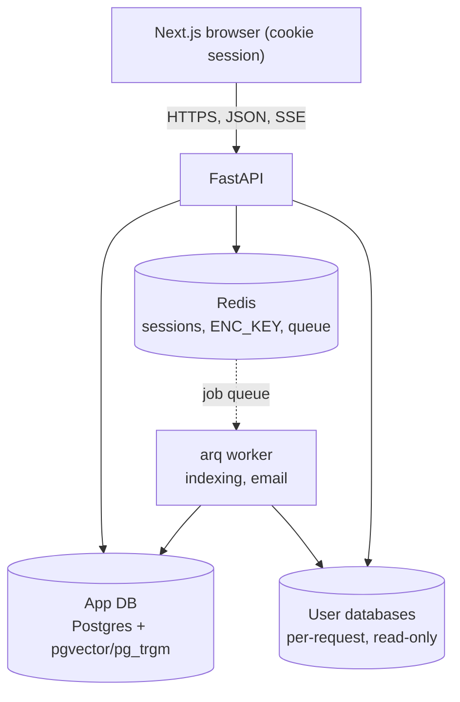
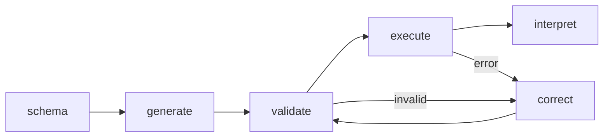
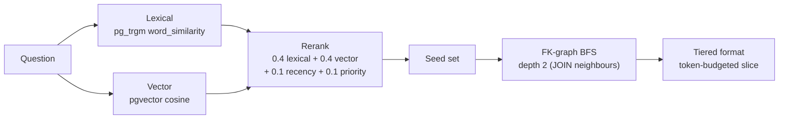

# Architecture

Multi-tenant QueryMind: users bring their own database (BYODB) and their own LLM
key (BYOK). The backend never stores a usable credential at rest and only ever
sees the relevant slice of a user's schema per query.

## Components

- **FastAPI app** — auth, workspaces, connections, LLM keys, the query endpoints
  (`/query`, `/query/stream`, `/query/export`), schema and activity routes.
- **App database** — users, sessions, workspaces, encrypted connections + keys,
  the schema index (tables/columns/FK edges with `vector(384)` embeddings), and
  per-user history/favorites/feedback/audit.
- **Redis** — session store, the per-session encryption key, conversation memory,
  and the `arq` job queue.
- **arq worker** — schema indexing, drift checks, FK-weight updates, email.
- **User databases** — reached per request via a fresh, read-only connection.

## Request flow (a query)

1. Auth + CSRF; resolve the workspace's connection (must be indexed) and the
   chosen/default BYOK key.
2. **Retrieve** the relevant schema slice (see below).
3. Build a per-request LLM provider from the decrypted key, open a fresh
   read-only connection to the user's database.
4. Run the **LangGraph agent** (below). Validation gates execution; on failure the
   agent self-corrects up to a retry cap.
5. Stream each node transition as an SSE stage event; persist the run; on success
   enqueue an FK-weight update.

## Schema retrieval

Indexing (background, on connect / reload): introspect tables, columns, FK edges
and row counts; build a one-line signature per table; embed signatures with
`bge-small` (CPU); persist to `connection_tables/columns/fk_edges`.

Per query, cost is independent of schema size:

The result card exposes the retrieval scores so developers can see what the agent
was shown.

## Security

- **Passwords** — Argon2id; the hash is self-describing (no separate login salt).
- **Credential encryption** — a password-derived envelope. At login the password
  derives `ENC_KEY` (Argon2id over `kdf_salt`), held only in Redis for the session.
  Each connection/key has a random DEK wrapped by `ENC_KEY`; credential fields are
  AES-GCM encrypted under the DEK. The server can decrypt only while the user is
  logged in — a stolen database alone yields nothing. Trade-off: a forgotten
  password is unrecoverable (reset rotates the salt and invalidates credentials).
- **Sessions** — opaque session id in an httpOnly cookie; a separate refresh token,
  stored hashed and rotated on every refresh; double-submit CSRF on mutations;
  rate limiting on `/auth/*`.
- **Query safety** — read-only connections (`default_transaction_read_only`),
  an AST validator blocking DDL/DML, an `EXPLAIN` dry-run, query timeouts, and an
  auto-injected row cap. Every query is audited.

## Data model (app database)

`users`, `sessions`, `email_tokens` · `workspaces`, `workspace_members` ·
`connections`, `llm_keys` (encrypted) · `connection_tables`, `connection_columns`,
`connection_fk_edges` (HNSW + trigram indexes) · `query_history`,
`saved_queries`, `query_feedback`, `audit_log`. Every user-data table is
workspace-scoped; cross-workspace access returns 404.

## Notable decisions

- One app engine; user databases are reached per-request, never pooled globally.
- Direct LLM SDKs (no LangChain wrappers); providers built per-request from the
  BYOK key so concurrent keys don't clash.
- The frontend gates auth client-side via `/me` (the session cookie is scoped to
  the backend origin, so a Next middleware can't read it cross-origin in dev).
